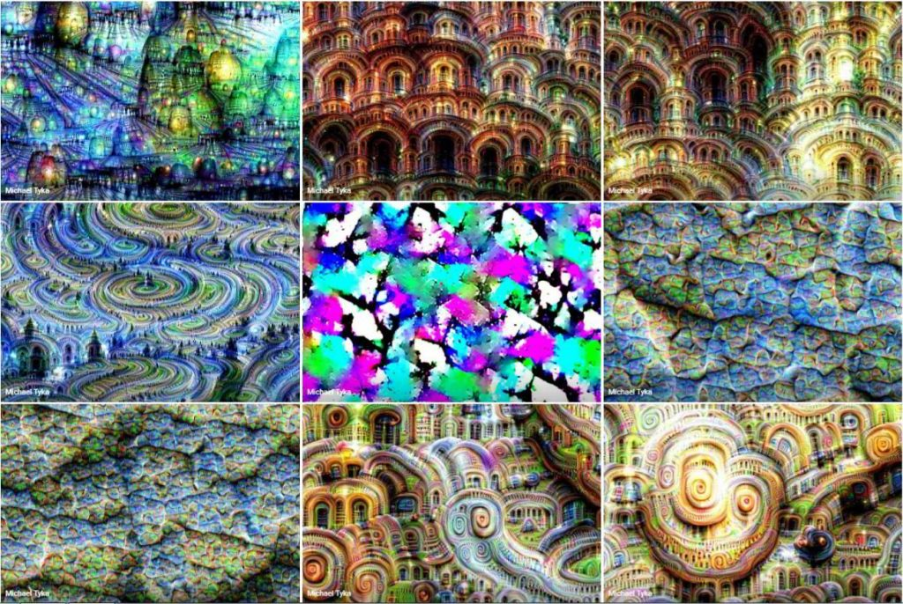

# DeepLearning

**Projects**  

There are all together 5 projects based on various DL methods. Namely, NN, CNN, RNN & LSTM, GAN, and Re-inforcement Learning.
Every projects has its own set off dependency. You must have Anaconda installed in your machine before you try the spefied environment.
