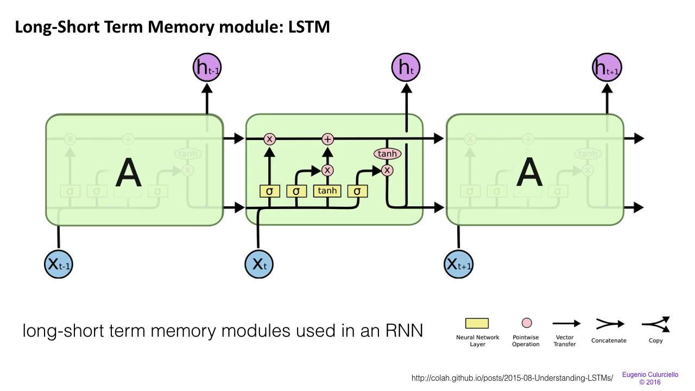

## Predicting Text

### Objective
In this project, I will generate my own Simpsons TV scripts using RNNs. I will be using part of the Simpsons dataset of scripts from 27 seasons. The Neural Network will generate a new TV script for a scene at Moe's Tavern.

### Instruction
conda env create -f tv-script.yml
source activate tv-script
